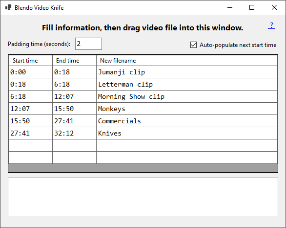

# Blendo Video Knife

## About
This is a tool for cutting a video into multiple segments.

This tool was made to give a fast/simple way to separate a video file into multiple segments, and to allow a custom filename for each segment. The name is 'Blendo Video Knife' but this tool can theoretically accept any file format readable by FFmpeg, such as audio files.

This is written in C# and a .sln solution for Visual Studio 2022 is provided. Windows only.

Pre-compiled binaries [available here](https://github.com/blendogames/BlendoVideoKnife/releases/tag/release).

## License
This source code is licensed under the MIT license.

## Credits
by [Brendon Chung](https://blendogames.com)

## Libraries used
- [FFmpeg](https://www.ffmpeg.org)
- [NReco.Csv](https://github.com/nreco/csv)